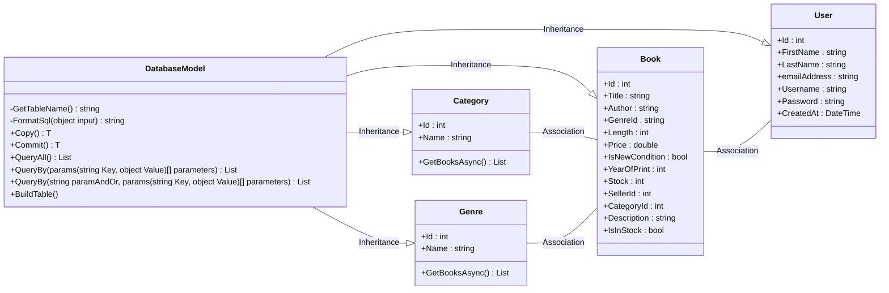

```mermaid
classDiagram
  direction LR
  class DatabaseModel {
    -GetTableName() string
    -FormatSql(object input) string
    +Copy() T
    +Commit() T
    +QueryAll() List<T>
    +QueryBy(params (string Key, object Value)[] parameters) List<T>
    +QueryBy(string paramAndOr, params (string Key, object Value)[] parameters) List<T>
    +BuildTable()
  }
  class User {
    +Id : int
    +FirstName : string
    +LastName : string
    +emailAddress : string
    +Username : string
    +Password : string
    +CreatedAt : DateTime
  }
  class Book {
    +Id : int
    +Title : string
    +Author : string
    +GenreId : string
    +Length : int
    +Price : double
    +IsNewCondition : bool
    +YearOfPrint : int
    +Stock : int
    +SellerId : int
    +CategoryId : int
    +Description : string
    +IsInStock : bool
  }
  class Category {
    +Id : int
    +Name : string
    +GetBooksAsync() List<Book>
  }
  class Genre {
    +Id : int
    +Name : string
    +GetBooksAsync() List<Book>
  }
  DatabaseModel --|> User : Inheritance
  DatabaseModel --|> Book : Inheritance
  DatabaseModel --|> Category : Inheritance
  DatabaseModel --|> Genre : Inheritance
  Book -- User  : Association
  Category -- Book  : Association
  Genre -- Book  : Association
```